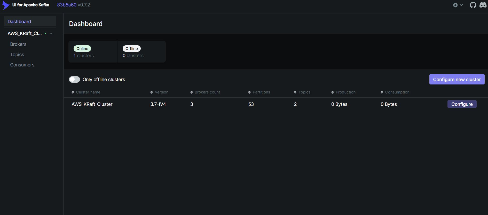
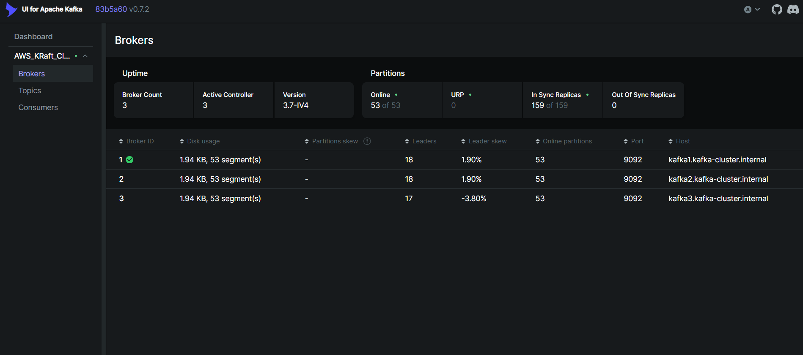

# Terraform AWS Kafka KRaft Cluster (HA)

A modern, highly available 3-node Apache Kafka cluster on AWS deployed using Terraform and Packer. 
This project utilizes Kafka's **KRaft mode**, completely eliminating the need for Zookeeper.

## Features
- **Kafka 3.7.0** running in KRaft mode (combined Broker and Controller roles).
- **High Availability (HA)**: 3-node quorum setup for redundancy and failover.
- **Automated Bootstrapping**: Dynamic node identification and DNS wait loops via cloud-init.
- **Private DNS**: AWS Route53 private hosted zones for seamless inter-broker communication.
- **Immutable Infrastructure**: Uses Packer to bake the Kafka AMI.

---

## Requirements
* An AWS Account
* [Packer](https://www.packer.io/) - To build the Kafka AMI.
* [Terraform](https://www.terraform.io/) - To provision the VPC, EC2 instances, Security Groups, and Route53 DNS.

---

## Quick Start

### 1. Build the Kafka AMI
Before running Terraform, you must bake the Kafka AMI using Packer.

```bash
cd packer
# Update variables.json with your AWS VPC and Subnet details if necessary
packer build -var-file=variables.json kafka.json
cd ..
```

### 2. Provision Infrastructure
Once the AMI is created, use Terraform to deploy the cluster.

> [!IMPORTANT]
> If you are running on Windows and have deployed this previously, you MUST delete the old `terraform-aws-kafka.pem` file before running `terraform apply`, otherwise Terraform will fail with an "Access is denied" error.
> Run these commands in Command Prompt to force delete the old key:
> ```cmd
> icacls terraform-aws-kafka.pem /reset
> del /F terraform-aws-kafka.pem
> ```

```bash
terraform init
terraform plan
terraform apply
```
*Note: The cluster takes about 5-6 minutes to fully initialize. A built-in wait loop ensures Kafka does not start until the Route53 DNS records have fully propagated across the VPC.*

---

## Troubleshooting: Windows SSH Key Error
When Terraform runs, it generates a private key (`terraform-aws-kafka.pem`). On Windows, this file might inherit default permissions that are "too open", causing the SSH client to reject it (`Permissions for 'terraform-aws-kafka.pem' are too open`).

Run these two commands in Command Prompt to fix the permissions:
```cmd
icacls terraform-aws-kafka.pem /inheritance:r
icacls terraform-aws-kafka.pem /grant "%USERNAME%:R"
```

---

## Verifying the Cluster

SSH into any of the newly created Kafka nodes using the public IP from the Terraform output:
```bash
ssh -i terraform-aws-kafka.pem ubuntu@<KAFKA_PUBLIC_IP>
```

### Check Service Status
```bash
sudo systemctl status kafka
```

### Check KRaft Quorum Health
```bash
/home/kafka/kafka/bin/kafka-metadata-quorum.sh --bootstrap-server localhost:9092 describe --status
```
*You should see a Leader elected and all 3 nodes listed under `CurrentVoters`.*

### Kafka UI (Web Dashboard)

After successfully applying the Terraform configuration, a dedicated EC2 instance is automatically provisioned to run the **Provectus Kafka UI** via Docker. 

You can access the web dashboard using the URL provided in the Terraform output (`kafka_ui_url`).

```bash
# Example Output
kafka_ui_url = "http://<KAFKA_UI_PUBLIC_IP>:8080"
```

> [!NOTE]
> It may take 2-3 minutes after the infrastructure is provisioned for Docker to install and the Kafka UI container to start. If the site cannot be reached immediately, please wait a moment and refresh the page.

#### Features Available in UI
- Monitor cluster health and KRaft Quorum status.
- View and manage Topics, Partitions, and Replication Factors.
- Produce and consume messages directly from your browser.

#### Kafka UI Dashboard Overview


#### Kafka Broker List


---

## Kafka Usage Examples

Once connected to a node, you can test the cluster with these built-in Kafka scripts.

**Create a Highly Available Topic (Replication Factor = 3):**
```bash
/home/kafka/kafka/bin/kafka-topics.sh --bootstrap-server localhost:9092 --create --topic my-ha-topic --partitions 3 --replication-factor 3
```

**Produce Messages to the Topic:**
```bash
/home/kafka/kafka/bin/kafka-console-producer.sh --broker-list localhost:9092 --topic my-ha-topic
```

**Consume Messages from the Topic (Open in a second SSH session):**
```bash
/home/kafka/kafka/bin/kafka-console-consumer.sh --bootstrap-server localhost:9092 --topic my-ha-topic --from-beginning
```